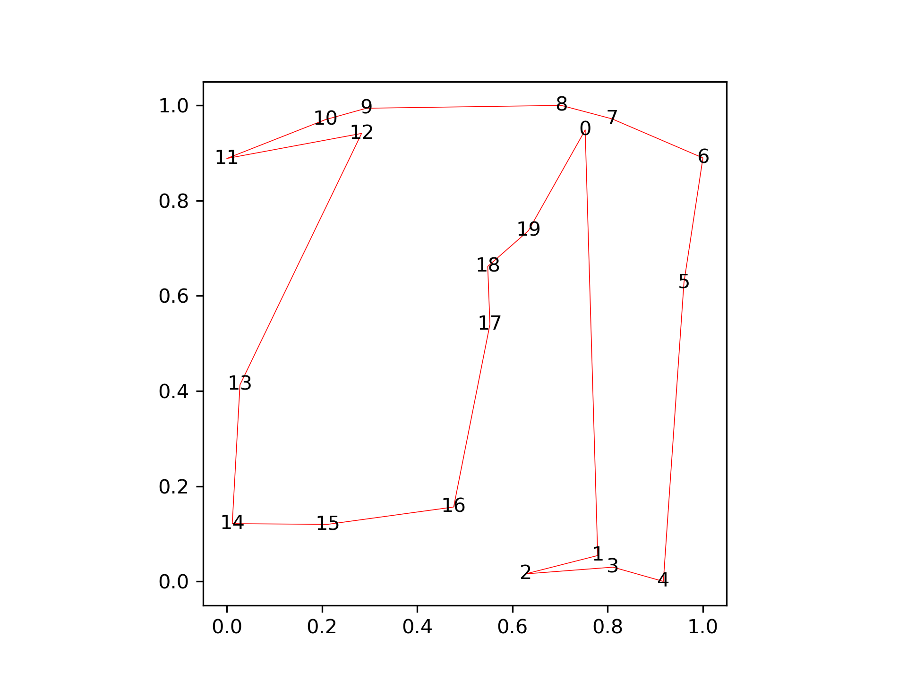

[](LICENSE)
[](https://github.com/bast/polygenerator/actions)
[](https://badge.fury.io/py/polygenerator)


# polygenerator

Generates random simple polygons. This can be useful to test computational geometry
algorithms or to generate maps.


## Installation

```
$ pip install polygenerator
```


## API

There are 3 functions and each returns a list of (x, y) tuples:
- `random_convex_polygon(num_points)`
- `random_polygon(num_points)`
- `random_star_shaped_polygon(num_points)`

All polygons are generated to be counterclockwise. You can reverse the order
outside if you need the points in clockwise order.

The generated polygon is made to fit the bounding box (0.0, 0.0) ... (1.0, 1.0)
and you can then scale and translate it to where you need it.


## Example

```python
from polygenerator import (
    random_polygon,
    random_star_shaped_polygon,
    random_convex_polygon,
)


# these two are only for demonstration
import matplotlib.pyplot as plt
import random


def plot_polygon(polygon, out_file_name):
    plt.figure()
    plt.gca().set_aspect("equal")

    for i, (x, y) in enumerate(polygon):
        plt.text(x, y, str(i), horizontalalignment="center", verticalalignment="center")

    # just so that it is plotted as closed polygon
    polygon.append(polygon[0])

    xs, ys = zip(*polygon)
    plt.plot(xs, ys, "r-", linewidth=0.4)

    plt.savefig(out_file_name, dpi=300)
    plt.close()


# this is just so that you can reproduce the same results
random.seed(5)

polygon = random_polygon(num_points=20)

print(polygon)
# [(0.752691110661913, 0.948158571633034), (0.7790276993942304, 0.05437135270534656), ..., (0.633385213909564, 0.7365967958574935)]

plot_polygon(polygon, "random_polygon.png")
```


```python
polygon = random_star_shaped_polygon(num_points=20)
plot_polygon(polygon, "random_star_shaped_polygon.png")
```


```python
polygon = random_convex_polygon(num_points=20)
plot_polygon(polygon, "random_convex_polygon.png")
```


## Notes

- For the generation of a concave/general polygon, algorithms with better
  scaling exist but this was good enough for me since for testing I did not
  need polygons with more than 100 points. Improvements welcome.
